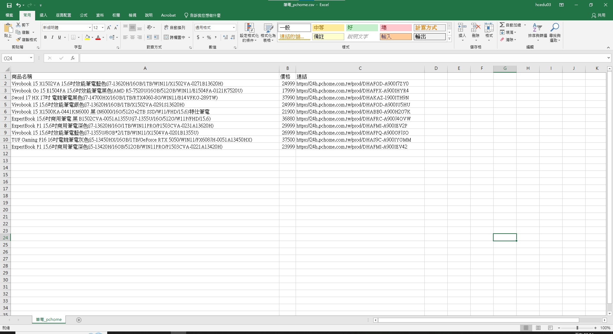

# pchome-price-crawler
PChome 商品比價小工具 (PChome Product Price Crawler)

---

##  專案簡介
這是一個用 **Python + Requests + Pandas** 製作的簡單爬蟲工具，  
可以即時搜尋 PChome 商品，並將商品名稱、價格、連結整理成表格輸出為 CSV。  

---

##  功能特色
-  透過 PChome API 即時查詢商品
-  擷取商品名稱、價格與購買連結
-  以 **Pandas** 輸出結果成 CSV 檔案
-  預設顯示前 10 筆結果（可自行修改 `limit`）

---

##  使用方式

### 1 安裝必要套件

pip install requests pandas

### 2 執行程式

python main.py

### 3 輸入關鍵字


輸入商品關鍵字：
ex:筆電


### 4 查詢結果

* 終端機會顯示商品清單（名稱 / 價格 / 連結）
* 程式會自動輸出 CSV 檔，例如：`筆電_pchome.csv`

---

##  專案結構

```
.
├── main.py                  # 主程式
├── README.md                # 專案說明文件
├── LICENSE                  # MIT 授權
└── .gitignore               # 忽略檔案
```

---

##  範例輸出



##  授權

此專案以 **MIT License** 授權，歡迎自由使用與修改。
